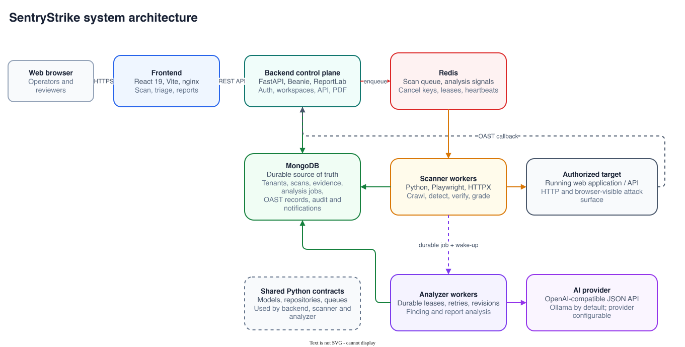

<div align="center">

# Running SentryStrike with Docker

**Container topology, configuration, operations, and production hardening.**

[](https://docs.docker.com/compose/)
[](https://www.mongodb.com/)
[](https://redis.io/)
[](https://playwright.dev/python/)

</div>

This guide covers the repository's [`docker-compose.yml`](docker-compose.yml), which defines the frontend, backend, scanner, analyzer, MongoDB, and Redis services. It is a deployment baseline, not a complete production security boundary: TLS termination, secret management, authenticated data stores, monitoring, and backups remain operator responsibilities.

> [!CAUTION]
> SentryStrike actively probes web applications. Containerization does not make unauthorized scanning safe or legal. Only scan targets covered by explicit written authorization.

## Architecture



| Service    | Image or build                                    | Responsibility                                                                          | Published port                   |
| ---------- | ------------------------------------------------- | --------------------------------------------------------------------------------------- | -------------------------------- |
| `frontend` | Vite build on Node 24; nginx-unprivileged runtime | Serves the React SPA and proxies `/api/` to the backend                                 | `${FRONTEND_PORT:-80}` → `8080`  |
| `backend`  | Python 3.12 slim                                  | FastAPI control plane, auth, workspaces, reports, PDF, and OAST callbacks               | `${BACKEND_PORT:-8000}` → `8000` |
| `scanner`  | Playwright Python 1.60                            | Crawl, detection, verification, grading, and re-verification workers                    | None                             |
| `analyzer` | Python 3.12 slim                                  | Durable AI analysis through Ollama or another OpenAI-compatible provider                | None                             |
| `mongo`    | MongoDB 7                                         | Durable tenants, scans, evidence, analysis jobs, OAST records, audit, and notifications | Internal only                    |
| `redis`    | Redis 7 Alpine                                    | Scan jobs, wake-up signals, cancellation, leases, and heartbeats                        | Internal only                    |

MongoDB is the durable source of truth. Redis is deliberately configured without RDB snapshots or AOF persistence and has no named volume; treat its queues and coordination keys as ephemeral.

All application images run as non-root users.

## Prerequisites

- Docker Engine or Docker Desktop with Compose v2.24 or newer
- At least 4 GB of available memory; browser-heavy scans may require more
- An Ollama instance with the configured model, or another reachable OpenAI-compatible provider, when AI analysis is enabled
- A public HTTPS endpoint when OAST callbacks must be received from remote targets

Confirm Docker and Compose are available:

```bash
docker version
docker compose version
docker compose config --services
```

The final command should list `redis`, `mongo`, `scanner`, `analyzer`, `backend`, and `frontend`.

## Configuration

Create local configuration files from the committed templates:

```bash
cp .env.example .env
cp backend/.env.example backend/.env
cp scanner/.env.example scanner/.env
cp analyzer/.env.example analyzer/.env
```

These files are ignored by Git. Review them before starting containers; example values are development defaults, not production secrets.

### Shared deployment settings

The root `.env` coordinates infrastructure and values used by more than one service:

```dotenv
MONGODB_DB_NAME=sentrystrike
SCAN_QUEUE_NAME=sentrystrike:scans
ANALYSIS_QUEUE_NAME=sentrystrike:analysis
PUBLIC_HOSTNAME=https://sentry.example.com
FRONTEND_PORT=80
BACKEND_PORT=8000
VITE_API_URL=/api/v1
```

Compose overrides `MONGODB_URI` and `REDIS_URL` inside Python containers with the internal service addresses `mongo:27017` and `redis:6379`. The localhost values in `.env.example` remain useful when Python services run directly on the host.

`VITE_API_URL` is a frontend build argument, not a runtime setting. Rebuild the frontend whenever it changes.

### Backend settings

Review at least these values in `backend/.env`:

```dotenv
APP_DEBUG=false
CORS_ORIGINS=["https://sentry.example.com"]
AUTH_COOKIE_SECURE=true
AUTH_COOKIE_SAMESITE=lax
EMAIL_FROM=SentryStrike <security@example.com>
EMAIL_SMTP_HOST=smtp.example.com
EMAIL_SMTP_PORT=587
EMAIL_SMTP_USER=
EMAIL_SMTP_PASSWORD=
EMAIL_SMTP_STARTTLS=true
```

Registration is invitation-only. SMTP credentials are required when invitation and notification email must be delivered rather than inspected through local CLI output.

### Scanner settings

Scanner traffic and browser budgets belong in `scanner/.env`:

```dotenv
CRAWL_DEPTH=3
CRAWL_MAX_URLS=200
CRAWL_RATE_LIMIT_PER_SECOND=8.0
CRAWL_BROWSER_MODE=auto
CRAWL_BROWSER_MAX_INTERACTIONS=25
CRAWL_BROWSER_BUDGET_SECONDS=300.0
REQUEST_TIMEOUT_SECONDS=10.0
SCANNER_CONCURRENCY=8
SCAN_MODE=verified
NVD_API_KEY=
```

Start conservatively for fragile targets. Authenticated target credentials are submitted per scan, not read from environment files, and never persisted to MongoDB. They exist only in the Redis job payload and worker memory; Redis removes the payload when a worker claims it.

### AI analysis provider

The analyzer is configured for Ollama by default and accepts any provider implementing an OpenAI-compatible chat-completions API:

```dotenv
AI_BASE_URL=http://host.docker.internal:11434/v1
AI_MODEL=gemma4:e4b-it-qat-16k
AI_API_KEY=
AI_TIMEOUT_SECONDS=120
AI_MAX_RETRIES=3
AI_JSON_MODE=true
```

Build the default model once on the Ollama host before the first scan:

```bash
ollama create gemma4:e4b-it-qat-16k -f analyzer/ollama/Modelfile
```

It pins the context window the analyzer's prompts require. A stock build with a
smaller window does not reject an oversized prompt; it silently drops the
overflow and answers from what remains, which produces confident analysis of
evidence the model never saw. See [`analyzer/ollama/README.md`](analyzer/ollama/README.md).

Make sure the configured model exists in Ollama and the service is reachable from Docker. With the default local Ollama configuration, scan evidence stays within the deployment. For a hosted or separately deployed provider, replace `AI_BASE_URL`, `AI_MODEL`, and `AI_API_KEY` as required; that provider receives the analysis input, so review its data-handling terms. Provider responses must support the analyzer's structured JSON contract and the context window must cover the analyzer's prompt sizes.

### OAST routing

The backend is the OAST collaborator. It receives target callbacks at `/oast/{interaction_id}`, stores them in MongoDB, and answers scanner polling requests at `/oast/poll`.

Docker Compose gives the scanner two addresses for those backend routes because they are reached from different network locations:

```dotenv
OAST_CALLBACK_BASE_URL=http://host.docker.internal:8000/oast
OAST_POLL_URL=http://backend:8000/oast/poll
```

- `OAST_CALLBACK_BASE_URL` is the backend callback route as seen by the target receiving the test payload.
- `OAST_POLL_URL` is the same backend service as seen by the scanner on the Compose network.
- The backend validates interaction IDs before it stores or returns a callback.

Set Compose-specific OAST overrides in the root `.env`, not `scanner/.env`.
Compose interpolation occurs before service `env_file` values are loaded. The
default callback follows `BACKEND_PORT`, and both scanner and analyzer containers
map `host.docker.internal` through Docker's host gateway for Linux portability.

For a public deployment, set `OAST_CALLBACK_BASE_URL=https://sentry.example.com/oast` in the root `.env` and route `/oast/` at the external reverse proxy directly to `backend:8000`. The bundled frontend nginx configuration proxies `/api/`, but it does not expose `/oast/`.

## Data-store-only development

To run the application services directly on the host, start only the data stores:

```bash
docker compose up -d mongo redis
docker compose ps
```

Then start the backend, scanner, analyzer, and frontend on the host using the [local development instructions](README.md#quick-start-for-local-development). The root `.env.example` already uses localhost addresses for this topology.

Stop the data stores without deleting MongoDB data:

```bash
docker compose down
```

## Full-stack workflow

Build and start the complete stack with:

```bash
docker compose config
docker compose build
docker compose up -d
docker compose ps
```

Follow startup logs in another terminal:

```bash
docker compose logs -f backend scanner analyzer
```

Open the UI at <http://localhost> when `FRONTEND_PORT=80`. The API is also published directly at <http://localhost:8000/api/v1> unless `BACKEND_PORT` is changed.

Useful lifecycle commands:

```bash
docker compose up -d
docker compose restart scanner analyzer
docker compose stop
docker compose down
```

Rebuild after source, dependency, Dockerfile, frontend build-variable, or base-image changes:

```bash
docker compose build --pull
docker compose up -d
```

## Health checks

| Service    | Health signal                                                 | What it proves                                                                                    |
| ---------- | ------------------------------------------------------------- | ------------------------------------------------------------------------------------------------- |
| `frontend` | HTTP request to `http://localhost:8080/` inside the container | nginx can serve the built SPA                                                                     |
| `backend`  | `GET /api/v1/health`                                          | API process is responding after MongoDB and Redis startup                                         |
| `scanner`  | Redis `PING` from the scanner container                       | The container can reach Redis; it does not independently prove the worker loop is processing jobs |
| `analyzer` | Signal check against PID 1                                    | Analyzer process is alive; provider readiness is surfaced through durable job failures            |
| `mongo`    | `db.runCommand({ ping: 1 })`                                  | MongoDB accepts commands                                                                          |
| `redis`    | `redis-cli ping`                                              | Redis accepts commands                                                                            |

Inspect health and recent failures:

```bash
docker compose ps
docker compose logs --tail=200 backend scanner analyzer
curl http://localhost:8000/api/v1/health
```

## Logs

Container logs are the primary operational stream:

```bash
docker compose logs -f
docker compose logs -f backend
docker compose logs -f scanner
docker compose logs -f analyzer
```

Scanner file logs are stored in the `scanner_logs` named volume at `/app/logs`. Inspect them from a running worker:

```bash
docker compose exec scanner sh -c 'tail -n 200 /app/logs/scanner.log'
```

Treat logs as sensitive because they may contain target URLs and security evidence.

## Scaling workers

Scanner and analyzer workers can scale independently because they consume shared queues and use leases and guarded durable updates:

```bash
docker compose up -d --scale scanner=4 --scale analyzer=2
```

Monitor MongoDB, Redis, host memory, browser processes, target load, and provider throughput before increasing worker counts. Scanner replicas share the `scanner_logs` volume, so container stdout is preferable when diagnosing an individual replica.

For browser-heavy workloads, add resource controls through a local Compose override:

```yaml
services:
  scanner:
    shm_size: 1gb
    deploy:
      resources:
        limits:
          cpus: '2.0'
          memory: 4g
  analyzer:
    deploy:
      resources:
        limits:
          cpus: '1.0'
          memory: 1g
```

Validate overrides with `docker compose config` before applying them.

## Data persistence and backup

Compose creates two named volumes:

- `mongo_data` stores all durable SentryStrike data.
- `scanner_logs` stores rotating scanner log files.

`docker compose down` preserves named volumes. `docker compose down -v` permanently deletes them and should only be used when a complete reset is intended.

Create a compressed MongoDB backup:

```bash
docker compose exec mongo mongodump --db sentrystrike --archive=/tmp/sentrystrike.archive --gzip
docker compose cp mongo:/tmp/sentrystrike.archive ./sentrystrike.archive
```

Restore into the configured database:

```bash
docker compose cp ./sentrystrike.archive mongo:/tmp/sentrystrike.archive
docker compose exec mongo mongorestore --archive=/tmp/sentrystrike.archive --gzip --drop
```

> [!WARNING]
> `mongorestore --drop` deletes matching collections before restoring them. Verify the target deployment and backup file before running it.

Backups should be encrypted, access-controlled, tested through periodic restoration, and stored separately from the Docker host.

## Production hardening

Before exposing SentryStrike outside an isolated development environment:

1. Put a reverse proxy or ingress in front of the stack and terminate HTTPS there.
2. Set `AUTH_COOKIE_SECURE=true` and restrict `CORS_ORIGINS` to trusted origins.
3. Keep MongoDB and Redis off public interfaces; add authentication and network policy appropriate to the environment.
4. Move SMTP and provider credentials to the deployment platform's secret manager instead of baking them into images.
5. Restrict direct access to the published backend port or remove that publication through a Compose override when only the frontend proxy and OAST ingress need it.
6. Keep every application container on its configured non-root runtime user.
7. Set CPU, memory, process, request, crawl, and browser limits based on measured workloads.
8. Pin and scan base images, rebuild regularly, and review dependency CVEs.
9. Centralize logs and alert on unhealthy containers, worker-heartbeat loss, repeated analysis failures, and queue growth.
10. Schedule MongoDB backups and restoration tests.

The scanner requires outbound access to authorized targets, NVD when enrichment is enabled, and the OAST polling endpoint. The analyzer requires access to its configured AI provider. Restrict other egress where practical.

## Troubleshooting

### An application image fails to build

Confirm the build is running from the repository root and inspect the failing
service without using cached layers:

```bash
docker compose build --no-cache backend
docker compose build --no-cache scanner
docker compose build --no-cache analyzer
docker compose build --no-cache frontend
```

### Frontend returns `502 Bad Gateway`

Check backend state and internal connectivity:

```bash
docker compose ps backend
docker compose logs --tail=200 backend
docker compose exec frontend wget -qO- http://backend:8000/api/v1/health
```

### Scanner or analyzer cannot reach Redis

```bash
docker compose ps redis
docker compose logs redis
docker compose exec scanner python -c "import os,redis; print(redis.Redis.from_url(os.environ['REDIS_URL']).ping())"
```

Inside containers, `REDIS_URL` must use the Compose service name, not localhost. The Compose file sets it to `redis://redis:6379/0`.

### AI analysis reports provider failures

Confirm the provider is running, the configured model exists, and the endpoint is reachable from the analyzer container:

```bash
docker compose exec analyzer python -c "import os,urllib.request; print(urllib.request.urlopen(os.environ['AI_BASE_URL'].rstrip('/') + '/models', timeout=10).status)"
docker compose logs --tail=200 analyzer
```

For Ollama on the Docker host, ensure it accepts connections from Docker and that `AI_BASE_URL` uses `host.docker.internal`, not `localhost`.

### Scans remain queued

Check scanner replicas, logs, and heartbeat keys:

```bash
docker compose ps scanner
docker compose logs --tail=200 scanner
docker compose exec redis redis-cli --scan --pattern 'sentrystrike:worker:heartbeat:*'
```

The scanner Compose health check validates Redis connectivity only. Heartbeat keys and worker logs provide stronger evidence that the worker loop is alive.

### OAST callbacks are not recorded

Verify that the callback URL is publicly routable from the target environment, `/oast/` reaches the backend, and the scanner can poll internally:

```bash
docker compose logs --tail=200 backend scanner
docker compose exec scanner python -c "import os; print(os.environ.get('OAST_CALLBACK_BASE_URL')); print(os.environ.get('OAST_POLL_URL'))"
```

Localhost URLs embedded in payloads cannot be reached by a remote target. Use an authorized public hostname or controlled tunnel and restart the scanner after changing callback configuration.

### Playwright browser processes fail or are killed

Increase scanner memory and shared memory, reduce `SCANNER_CONCURRENCY`, and lower browser interaction and time budgets. Confirm the scanner base image tag still matches the pinned Playwright Python version.

## Related documentation

- [Project overview](README.md)
- [Backend guide](backend/README.md)
- [Scanner guide](scanner/README.md)
- [Analyzer guide](analyzer/README.md)
- [Frontend guide](frontend/README.md)
