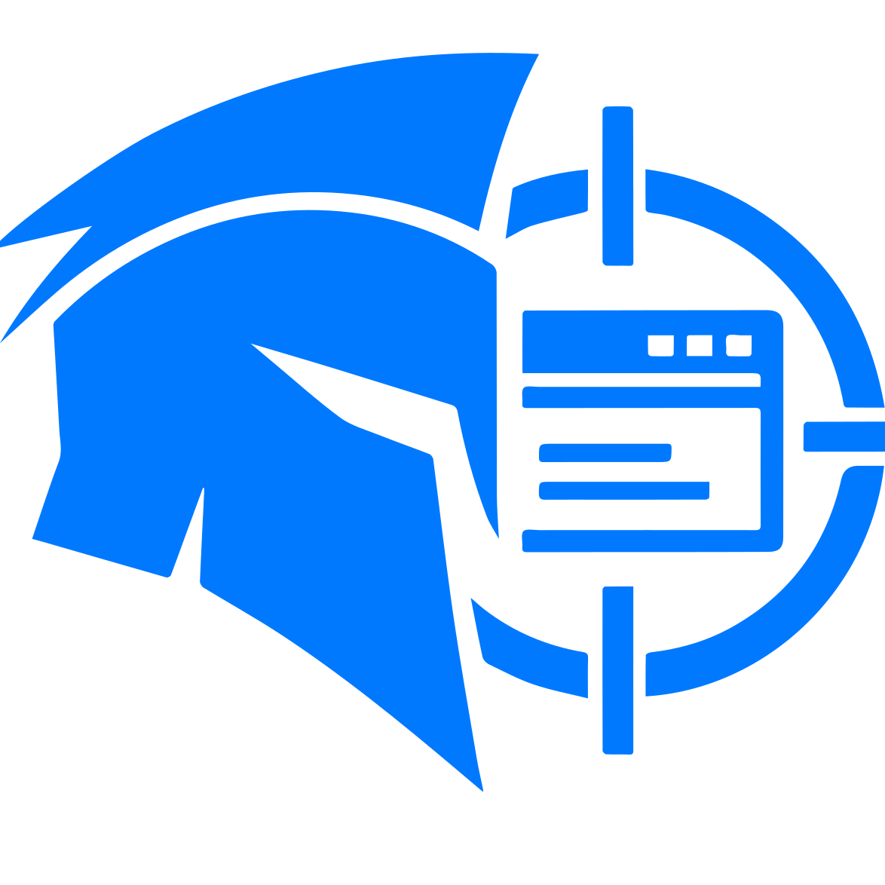

<div align="center">



# SentryStrike

**An evidence-driven DAST platform for authorized web application security testing.**

Crawl modern web applications, run bounded active and passive checks, verify candidate findings,
and turn reproducible evidence into review-ready reports from one multi-tenant workspace.

[](https://www.python.org/)
[](https://fastapi.tiangolo.com/)
[](https://react.dev/)
[](https://playwright.dev/python/)
[](https://www.mongodb.com/)
[](https://redis.io/)
[](https://docs.docker.com/compose/)

</div>

> [!CAUTION]
> SentryStrike sends active security-testing payloads and can exercise application workflows. Use it only against systems you own or have explicit written authorization to assess. The operator is responsible for scope, test windows, data handling, and legal compliance.

## What SentryStrike is

SentryStrike is a Dynamic Application Security Testing (DAST) platform for web application VAPT workflows. It combines browser-assisted attack-surface discovery, deterministic verification, confidence-graded evidence, collaboration, and reporting. It helps security teams automate repeatable checks; it does not replace threat modeling, source review, business-logic testing, or expert manual penetration testing.

The scan engine follows a practical evidence pipeline:

1. **Crawl** traditional sites and JavaScript-heavy SPAs through HTTP and optional Playwright-assisted discovery.
2. **Fingerprint** frameworks and components, then enrich version evidence with known CVEs from the NVD.
3. **Detect** authentication, access-control, injection, file-handling, server-side, transport, and configuration weaknesses.
4. **Verify** candidates with response differentials, timing checks, browser execution, and OAST callbacks where applicable.
5. **Grade** evidence strength and confidence, calculate CVSS-based severity, map coverage, and deduplicate test pollution.
6. **Report** results through a live workspace, triage workflows, focused re-verification, and downloadable PDF reports.

## Highlights

- HTTP and browser-assisted crawling for routes, forms, parameters, SPA interactions, and observed API traffic
- Per-scan main, secondary, and privileged test accounts without persisting target credentials to MongoDB
- BOLA/IDOR, authentication, SQL/NoSQL/command injection, XSS, SSRF, CSRF, file inclusion/upload, redirect, TLS, header, sensitive-path, and supply-chain checks
- Reproducible request/response evidence with confidence, evidence-strength, review-status, and coverage metadata
- MongoDB-backed OAST records for blind-verification workflows
- Tenant workspaces, invitations, roles, assignments, comments, remediation states, notifications, audit history, and retention controls
- Durable AI analysis with leases, retries, schema validation, revisions, and two-pass finding adjudication
- Ollama-first configuration with support for any OpenAI-compatible chat-completions provider
- Independent scanner and analyzer workers for separate throughput scaling

## Architecture


| Component                | Technology                               | Responsibility                                                                             |
| ------------------------ | ---------------------------------------- | ------------------------------------------------------------------------------------------ |
| [`frontend/`](frontend/) | React 19, Vite 8, Tailwind CSS 4, Lucide | Scan submission and monitoring, finding triage, collaboration, and reports                 |
| [`backend/`](backend/)   | FastAPI, Beanie, Motor, ReportLab        | Authenticated API, tenant workflows, scan coordination, OAST callbacks, and PDF generation |
| [`scanner/`](scanner/)   | Python, Playwright, HTTPX                | Crawling, fingerprinting, bounded detection, verification, grading, and re-verification    |
| [`analyzer/`](analyzer/) | Python, HTTPX                            | Durable AI analysis through Ollama by default or any OpenAI-compatible provider            |
| [`shared/`](shared/)     | Pydantic, Beanie, Redis                  | Domain models, repositories, queue contracts, and cross-service policies                   |
| MongoDB                  | Durable document store                   | Tenants, scans, evidence, analysis jobs, OAST records, notifications, and audit history    |
| Redis                    | Ephemeral coordination                   | Scan jobs, analysis wake-up signals, cancellation keys, leases, and worker heartbeats      |

The backend creates the durable scan record before enqueueing a compact Redis job. A scanner worker claims that job, discovers and tests the authorized target, and continuously persists progress and evidence to MongoDB. Scan completion creates a durable analysis handoff; Redis wakes an analyzer worker, but MongoDB remains the source of truth for retries and recovery. The frontend reads current state exclusively through the backend API.

## Repository layout

```text
SentryStrike/
|-- frontend/       React single-page application
|-- backend/        FastAPI control plane and management CLI
|-- scanner/        DAST crawl, detection, verification, and re-verification worker
|-- analyzer/       Durable post-scan analysis worker
|-- shared/         Shared models, repositories, queues, and policies
|-- docs/assets/    Documentation assets and editable diagrams
|-- docker-compose.yml
|-- start-dev.ps1   Optional Windows multi-service development launcher
`-- .env.example    Cross-service configuration template
```

## Local development

### Prerequisites

- Python 3.12
- Node.js 20.19+ or 22.12+
- Docker with Docker Compose for MongoDB and Redis
- A POSIX-compatible shell such as Bash or Zsh

### 1. Configure the services

```bash
cp .env.example .env
cp backend/.env.example backend/.env
cp scanner/.env.example scanner/.env
cp analyzer/.env.example analyzer/.env
cp frontend/.env.example frontend/.env
```

Review the generated files before starting. For a typical local setup:

- Set `PUBLIC_HOSTNAME=http://localhost:5173` in the root `.env`.
- Configure SMTP in `backend/.env` if you want invitation emails delivered.
- Run Ollama with the configured model, or point `AI_BASE_URL` and `AI_MODEL` in `analyzer/.env` to another OpenAI-compatible provider.

### 2. Start the data stores

```bash
docker compose up -d mongo redis
```

### 3. Install the Python services

```bash
python -m venv .venv
source .venv/bin/activate
python -m pip install --upgrade pip
python -m pip install -e .
python -m pip install -r backend/requirements-dev.txt -r scanner/requirements-dev.txt -r analyzer/requirements-dev.txt
python -m playwright install chromium
```

### 4. Install the frontend

```bash
npm --prefix frontend ci
```

### 5. Start SentryStrike

Start each service in a separate terminal from the repository root. Activate the virtual environment in each Python service terminal first.

Backend:

```bash
source .venv/bin/activate
cd backend
uvicorn app.main:app --host 0.0.0.0 --port 8000 --reload
```

Scanner:

```bash
source .venv/bin/activate
cd scanner
export OAST_CALLBACK_BASE_URL="${OAST_CALLBACK_BASE_URL:-http://host.docker.internal:8000/oast}"
export OAST_POLL_URL="${OAST_POLL_URL:-http://localhost:8000/oast/poll}"
python -m app.worker
```

Analyzer:

```bash
source .venv/bin/activate
cd analyzer
python -m app.worker
```

Frontend:

```bash
cd frontend
npm run dev
```

Windows users can alternatively run `./start-dev.ps1` from PowerShell to open all four services in separate windows.

| Service               | Local URL                             |
| --------------------- | ------------------------------------- |
| Frontend              | <http://localhost:5173>               |
| Backend API           | <http://localhost:8000/api/v1>        |
| OpenAPI documentation | <http://localhost:8000/docs>          |
| Health endpoint       | <http://localhost:8000/api/v1/health> |

### 6. Create the first workspace owner

Registration is invitation-only. With the backend running, create the initial owner invitation from another terminal:

```bash
source .venv/bin/activate
cd backend
python -m app.cli invite-owner --email owner@example.com --org "Example Security" --member-limit 10
```

Open the invitation link printed by the command. If SMTP delivery fails in local development, the CLI still prints the valid link or token.

## Testing

```bash
source .venv/bin/activate
python -m pytest backend/tests
python -m pytest scanner/tests
python -m pytest analyzer/tests

npm --prefix frontend test
npm --prefix frontend run lint
npm --prefix frontend run build
```

Browser and integration suites may require Chromium, MongoDB, Redis, or isolated network-visible test targets. See the component guides for narrower commands and settings.

## Configuration and operations

Configuration is split by service ownership:

- [Root `.env.example`](.env.example): shared infrastructure, queues, cancellation, leases, and public-host settings
- [Backend configuration](backend/.env.example): sessions, invitations, SMTP, CORS, and retention
- [Scanner configuration](scanner/.env.example): crawl budgets, request caps, OAST, NVD, and logging
- [Analyzer configuration](analyzer/.env.example): provider, timeouts, retries, leases, and prompt limits
- [Frontend configuration](frontend/.env.example): build-time API base URL

For non-local environments, terminate TLS, enable secure auth cookies, restrict CORS, keep MongoDB and Redis on trusted networks, and expose the unauthenticated OAST callback only when blind-verification workflows require it. Treat scan evidence, logs, and reports as sensitive assessment data.

## Documentation

- [Frontend guide](frontend/README.md)
- [Backend guide](backend/README.md)
- [Scanner guide](scanner/README.md)
- [Analyzer guide](analyzer/README.md)
- [Shared package guide](shared/README.md)
- [Docker deployment guide](DOCKER.md)

## Responsible use

Obtain written authorization, define allowed hosts and methods, agree on test windows, use dedicated accounts and data, and establish escalation contacts before scanning. A missing automated finding is not proof that a target is secure; review coverage and evidence manually.
